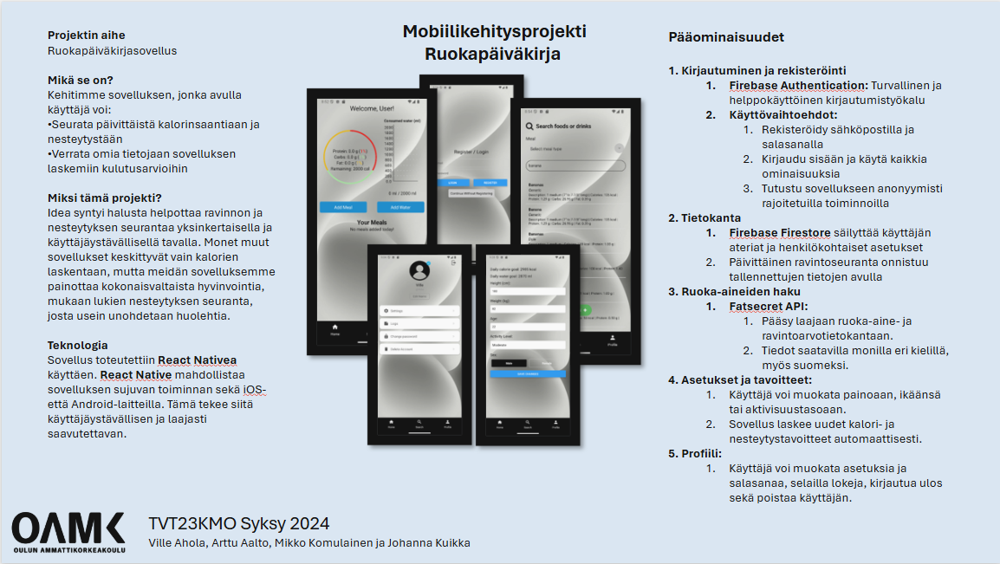

# Mobiilikehitysprojekti: Ruokapäiväkirja

## Projektin aihe
Ruokapäiväkirjasovellus

### Mikä se on?
Kehitämme sovelluksen, jonka avulla käyttäjä voi:
- Seurata päivittäistä kalorinsaantia ja nesteytystään
- Verrata omia tietojaan sovelluksen laskemiin kulutusarvioihin

### Miksi tämä projekti?
Idea syntyi halusta helpottaa ravinnon ja nesteytyksen seurantaa yksinkertaisella ja käyttäjäystävällisellä tavalla. Monet muut sovellukset keskittyvät vain kalorien laskentaan, mutta meidän sovelluksemme painottaa kokonaisvaltaista hyvinvointia, mukaan lukien nesteytyksen seurantaa, josta usein unohdetaan huolehtia.

### Teknologia
Sovellus toteutettiin **React Native** -tekniikalla. React Native mahdollistaa sovelluksen sujuvan toiminnan sekä iOS- että Android-laitteilla. Tämä tekee siitä käyttäjäystävällisen ja laajasti saavutettavan.

   

---

## Pääominaisuudet

1. **Kirjautuminen ja rekisteröinti**
    - **Firebase Authentication**: Turvallinen ja helppokäyttöinen kirjautumis- ja rekisteröintityökalu
    - Käyttövaihtoehdot:
        1. Rekisteröidy sähköpostilla ja salasanalla
        2. Kirjaudu sisään ja käytä kaikkia ominaisuuksia
        3. Tutustu sovellukseen anonyymisti rajoitetuilla toiminnoilla

2. **Tietokanta**
    - **Firebase Firestore**: Säilyttää käyttäjän ateriat ja henkilökohtaiset asetukset
    - Päivittäinen ravintoseuranta onnistuu tallennettujen tietojen avulla

3. **Ruoka-aineiden haku**
    - **Fatsecret API**: 
        1. Pääsy laajaan ruoka-aine- ja ravintoaineTietokantaan
        2. Tiedot saatavilla monilla eri kielillä, myös suomeksi

4. **Asetukset ja tavoitteet**
    - Käyttäjä voi muokata painoaan, ikäänsä ja aktiivisuustasoaan
    - Sovellus laskee uudet kalori- ja nesteytystavoitteet automaattisesti

5. **Profiili**
    - Käyttäjä voi muokata asetuksia ja salasanaa, selailla kokeja, kirjautua ulos sekä poistaa käyttäjätilin

---

## Posteri

## Projektin jäsenet 

[Ville Ahola](https://github.com/Ville-A)

[Arttu Aalto](https://github.com/ArttuA02)

[Mikko Komulainen](https://github.com/MikkoKom)

[Johanna Kuikka](https://github.com/johannakuikka)

**TVT23KMO Syksy 2024**
